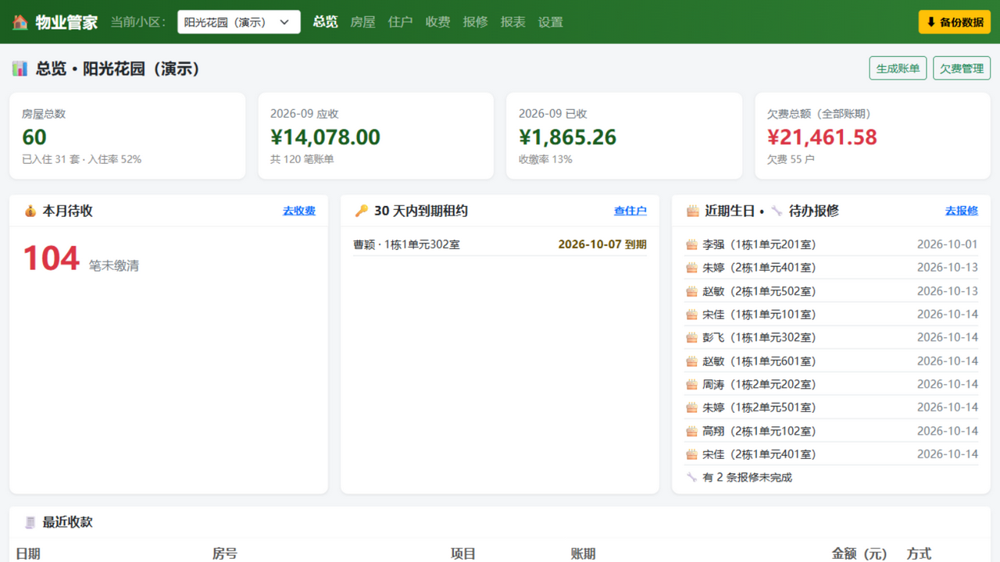
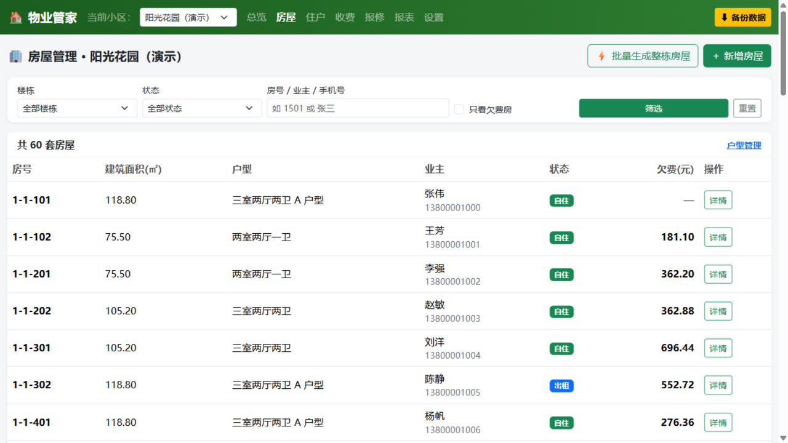
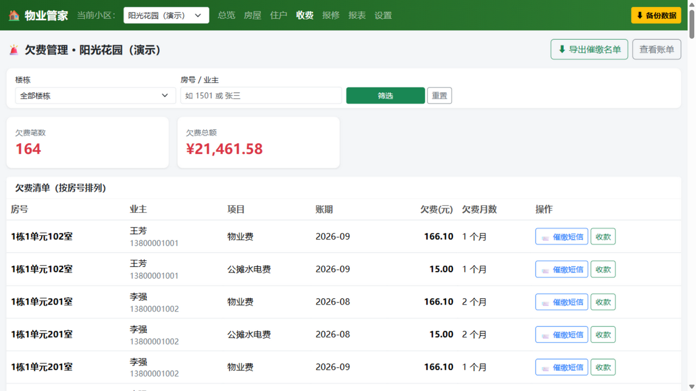
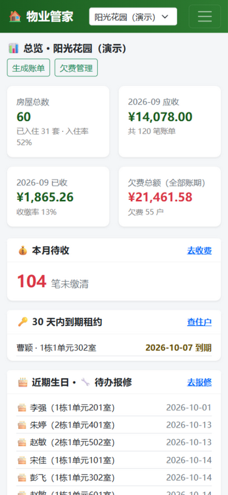

# 物业管家（个人版）

一套给**个人物业管理者**用的本地管理系统：管小区、管房屋、管住户、管物业费收缴。
不需要服务器、不需要联网、不需要任何技术基础——**双击启动，浏览器里点点鼠标就能用**。

- 界面全中文，说人话
- 数据 100% 存在自己电脑上（SQLite 单文件），不上传任何东西
- 危险操作全部二次确认，关键操作（缴费、过户、改金额）自动留痕
- 手机连同一 WiFi 也能打开看总览和欠费情况

## 界面预览

| 总览仪表盘 | 房屋与欠费标识 |
|---|---|
|  |  |

| 欠费管理（可生成催缴短信） | 手机端浏览 |
|---|---|
|  |  |

更多截图见 `docs/screenshots/`。

---

## 一、三步跑起来（Windows）

### 第 1 步：安装 Python（只需一次）

1. 打开网址：<https://www.python.org/downloads/>
2. 点击黄色按钮 **Download Python 3.x.x** 下载
3. 双击安装包，**第一屏最下面务必勾选 `Add Python to PATH`**，然后点 Install Now
4. 已经装过 Python 的电脑可以跳过这一步

### 第 2 步：双击 `启动.bat`

首次运行会自动安装运行环境（需要联网，约半分钟），之后每次都是秒开。

### 第 3 步：在浏览器里使用

系统首页会自动打开（地址是 `http://127.0.0.1:5000`）。第一次使用会引导你**创建小区**，
然后就能添加楼栋、批量生成房屋、登记住户、生成账单、登记收款了。

> 💡 **不想自己录入？** 打开「设置 → 演示数据 → 一键载入演示数据」，
> 系统会生成两个虚构小区（阳光花园、翡翠湾）的完整数据供你练习，练完一键清空。

**用完怎么退出？** 直接关闭黑色命令行窗口即可，数据已实时保存。

---

## 二、每个功能怎么用

### 1. 小区管理（第一件事）

1. 首次进入按提示填写小区名称、地址等信息，点保存
2. 有多个小区时，用**顶部导航栏左边的下拉框**切换“当前小区”，之后所有页面只显示该小区的数据
3. 「小区管理」页可以修改、删除小区（删除前会告诉你将连带删除多少数据，需二次确认）

### 2. 楼栋与房屋

**推荐流程：先建楼栋 → 批量生成房屋 → 逐套完善信息**

1. 「房屋 → 楼栋」：添加楼栋（编号如 `1#`、单元数、层数、有无电梯）
2. 「房屋 → 批量生成整栋房屋」：选楼栋，填单元数、层数、每层户数（如 2×6×2），
   一键生成 24 套房，房号自动编为 101、102……601、602
3. 「房屋 → 新增房屋」：也可以单套添加
4. 房屋列表支持按楼栋、状态、房号/业主筛选，**欠费的房屋金额显示红色**
5. 点房屋「详情」可以：
   - 登记业主、家庭成员、租户
   - 查看历史住户时间线（谁什么时候住过）
   - 「产权过户」：换业主时用，旧业主自动转入历史记录
   - 「一键缴清」：这一户有多张欠费账单时，一次收齐、自动按账期从旧到新冲抵

### 3. 户型

「房屋 → 户型管理」：维护“三室两厅两卫 A 户型”这类信息，多套房可共用一个户型；
页面会显示每种户型被多少套房使用，被使用的户型不能删除（防误删）。

### 4. 住户

- 住户信息**挂在房屋下**管理：进房屋详情 → 添加家庭成员 / 租户 / 业主
- 「住户」页：按姓名、手机号、证件号、房号**全局搜索**本小区所有住户（含历史住户）
- 成员搬走、租户退租：在房屋详情点「搬出」，自动转历史，不会丢记录
- 「导出通讯录」：一键导出 CSV，Excel 直接打开不乱码

### 5. 收费（核心）

**推荐流程：配置收费项目 → 生成账单 → 收款 → 看欠费/报表**

1. 「收费 → 收费项目」：配置物业费（按面积 2.2 元/㎡/月）、公摊水电费（按户 15 元/月）等
2. 「收费 → 生成账单」：选收费项目 + 账期（如 2026-09）→ 系统按面积/按户自动算好每户应收，
   先预览“共 N 户、合计 X 元”→ 确认生成
3. 账单收款：在账单列表点「收款」，填实收金额、日期、支付方式；**支持部分缴费**，
   状态自动流转：未缴 → 部分缴纳 → 已缴清
4. 减免/调整：在账单详情里可调整应收金额，**必须填原因**，调整历史永久留痕
5. 「收费 → 欠费管理」：欠费清单（可按楼栋筛选），
   支持一键**导出催缴名单 CSV**、为某户**生成催缴短信**（复制即可发）
6. 「收费 → 缴费流水」：按房号/业主/时间段/项目组合查询收款记录，可导出 CSV

### 6. 报表

「报表」页：按月或按年统计应收、实收、**收缴率**；欠费金额 Top 10 房源；各小区收缴率对比。
三张表都可导出 CSV。

### 7. 报修

「报修」页：登记报修（房号 + 内容），状态流转：待处理 → 处理中 → 已完成，可写处理备注。

---

## 三、数据存在哪里、怎么备份

| 事项 | 说明 |
|---|---|
| 数据位置 | 全部保存在程序目录的 `data/property.db` 一个文件里 |
| 自动备份 | 每天第一次启动时自动备份到 `data/backups/`，保留最近 14 份 |
| 手动备份 | 点顶部右侧的 **「⬇ 备份数据」** 按钮，浏览器会下载一个 `.db` 文件，存到 U 盘/网盘即可 |
| 恢复数据 | 「设置 → 恢复数据」上传之前备份的 `.db` 文件；**恢复前会自动把当前数据再备份一份**，恢复错了也能找回来 |
| 换电脑 | 新电脑装好 Python → 把整个项目文件夹拷过去 → 双击 `启动.bat`；或只把 `data/property.db` 拷到新项目的 `data/` 文件夹里 |

> ⚠️ 两个习惯请养成：**每周点一次备份数据**；删除小区/房屋/作废账单前看清确认弹窗里的影响范围。

---

## 四、手机上看

1. 手机和电脑连**同一个 WiFi**
2. 启动系统的窗口里会显示“手机访问：http://192.168.x.x:5000”这样的地址
3. 手机浏览器打开该地址即可查看总览、住户、欠费（建议只读浏览，录入在电脑上做）

---

## 五、常见问题

**Q：双击 启动.bat 提示“没有找到 Python”？**
按第一节安装 Python，记得勾选 `Add Python to PATH`。装完重新双击。

**Q：窗口里显示端口被占用 / 打不开页面？**
程序会自动换端口（5000 → 5001 …），以窗口里打印的地址为准。

**Q：能把系统文件夹移动到别的盘吗？**
可以，整个文件夹随意移动/复制，数据跟着文件夹走。

**Q：误删了数据怎么办？**
用最近一次备份恢复（设置 → 恢复数据）。所以，常备份！

**Q：电脑装不了 Python 怎么办？**
联系开发者，可以为你提供一个纯网页单文件版本的降级方案（数据存浏览器，支持一键导出/导入 JSON）。

**Q：想再复制一套自用版（不上传 GitHub、和开发版数据隔离）？**
把整个项目文件夹复制一份，删除副本里的 `.git` 文件夹和 `data` 文件夹，
再在副本根目录新建一个 `edition.txt`，内容写上 `自用版`（页面左上角会显示这个标记）。
副本与开发版互不影响；以后系统升级时，把新代码覆盖到副本里（**保留它的 `data` 文件夹和 `edition.txt`**）即可。

**Q：用 Mac？**
把 `启动.command` 用终端执行（或在 Finder 里右键 → 打开），用法与 Windows 一致。

---

## 六、给技术同学

- 技术栈：Python 3.10+ / Flask / SQLite（标准库 sqlite3），前端为本地化的 Bootstrap 5 + 原生 JS，无 npm 构建
- 金额以“分”为整数存储（杜绝浮点误差），面积以 0.01㎡ 整数存储
- 表结构、页面清单、防呆设计见 [docs/设计说明.md](docs/设计说明.md)
- 版本更新记录见 [CHANGELOG.md](CHANGELOG.md)
- 自动化冒烟测试：`python tests/smoke_test.py`（79 项检查，覆盖任务书全部验收标准）
- 目录结构：

```
property-management/
├── app.py               # 应用入口（建库、找端口、自动开浏览器）
├── config.py            # 配置（路径、端口）
├── database.py          # 数据库连接与建表
├── utils.py             # 校验工具（手机号/身份证/金额/账期）
├── routes/              # 路由层（按模块拆分）
├── services/            # 业务逻辑层（按模块拆分）
├── templates/           # 页面模板
├── static/              # 样式/脚本（Bootstrap 已本地化，离线可用）
├── data/                # 数据库与备份（自动创建，勿手动删除）
├── tests/smoke_test.py  # 自动化冒烟测试
├── 启动.bat              # Windows 一键启动
├── 启动.command          # Mac 一键启动
└── README.md
```
